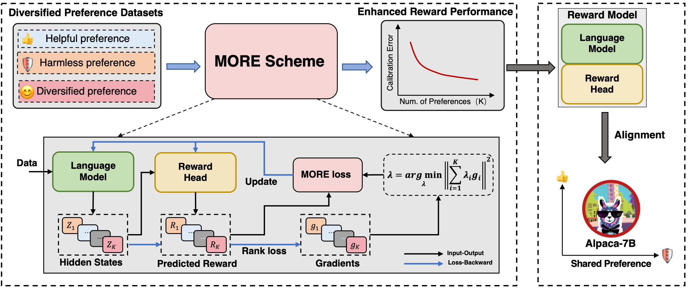

# MORE (Multi-objective Reward Modeling)

[](https://github.com/Linear95/DSP/blob/main/LICENSE)
[](https://github.com/Linear95/DSP/blob/main/DATA_LICENSE)
[](https://www.python.org/downloads/release/python-380/)
<p align="center">
  
</p>

Code for paper "[On Diversified Preferences of Large Language Model Alignment](https://arxiv.org/abs/2312.07401)".

## Preparation

### 1. Install dependencies: 

```pip install -r requirement.txt```

### 2 Download data:

Please download [data.zip](https://drive.google.com/drive/folders/10Mja3DRiXrFrp9Zg_arOR3wMOD6p8GsG?usp=drive_link) and unzip it to replace `data`.

## Run

Our experiments consist of 5 main steps:

### 1. Reward model training
```
REPO_DIR=./
DATA_DIR=./data
TRAIN_DATA_LIST="${DATA_DIR}/helpful.train.json \
                 ${DATA_DIR}/harmless.train.json \
                 ${DATA_DIR}/oaast1.train.json \
                 ${DATA_DIR}/webgpt.train.json \
                 ${DATA_DIR}/summ.train.json "

TEST_DATA_LIST="${DATA_DIR}/helpful.test.json \
                 ${DATA_DIR}/harmless.test.json \
                 ${DATA_DIR}/oaast1.test.json \
                 ${DATA_DIR}/webgpt.test.json \
                 ${DATA_DIR}/summ.test.json "

OUTPUT_DIR="<output_path>"
deepspeed --num_gpus 8 train.py \
    --do_train True \
    --report_to tensorboard \
    --eval_at_start False \
    --model_name_or_path <path_to_model> \
    --train_data_path ${TRAIN_DATA_LIST} \
    --eval_data_path ${TEST_DATA_LIST} \
    --remove_unused_columns false \
    --output_dir ${OUTPUT_DIR} \
    --logging_dir ${OUTPUT_DIR} \
    --num_train_epochs 1 \
    --per_device_train_batch_size 1 \
    --per_device_eval_batch_size 8 \
    --gradient_accumulation_steps 2 \
    --evaluation_strategy steps \
    --padding_side right \
    --truncation_side left \
    --pooling_type last \
    --max_length 512 \
    --save_strategy steps \
    --learning_rate 1e-6 \
    --eval_steps 50 \
    --logging_steps 50 \
    --save_steps 1000 \
    --deepspeed ${REPO_DIR}/configs/default_offload_opt_param.json \
    --tf32 false --fp16 false \
    --model_type "<pythia/llama>" \
    --gradient_checkpointing True \
    --resampling True \
    --resampling_size 40000 \
    --shuffle True \
    --more True \
    --task_num 5 \
    --reweight True \
    --normalize l2 \
    --alpha 0.99 \
    --debug_mode False 
```

Note:

- Set `--more False` and change `per_device_train_batch_size` from 1 to 5 for running the `MultiTask` baseline.
- `--resampling True` will sample data samples from raw datasets. The number of data samples (each preference dataset) will be `resampling_size`.
- `--alpha` is the momentum parameter for stabilizing optimization. Please see `trainer.py` or [paper](https://arxiv.org/pdf/2310.02702.pdf).

### 2. Reject Sampling Inference

```
REPO_DIR=./
accelerate launch --config_file ${REPO_DIR}/configs/inference.yaml ${REPO_DIR}/reward_model_inference.py \
    --model_type pythia \
    --model_name_or_path <path_to_model> \
    --data_path ${REPO_DIR}/data/hh_split_rm_alpaca_v0.sample.json \
    --save_path ${REPO_DIR}/data/inference_data/all_data.json
```

### 3. Reject Sampling Training

```
REPO_DIR=./
DATA_DIR="./data/"
TRAIN_DATA_LIST="${DATA_DIR}/helpful.train.json \
                 ${DATA_DIR}/harmless.train.json"
deepspeed --num_gpus 8 rjs_training.py \
    --model_type llama \
    --do_train True \
    --train_data_path ${TRAIN_DATA_LIST} \
    --model_name_or_path ${REPO_DIR}/lm_base/alpaca-7b \
    --output_dir ${REPO_DIR}/paper_final_checkpoints/alpaca-hh-sft \
    --remove_unused_columns False \
    --max_length 512 \
    --report_to none \
    --per_device_train_batch_size 1 \
    --per_device_eval_batch_size 8 \
    --gradient_accumulation_steps 8 \
    --logging_strategy steps \
    --logging_steps 1 \
    --save_strategy epoch \
    --num_train_epochs 1 \
    --learning_rate 1e-6 \
    --lr_scheduler_type cosine \
    --evaluation_strategy no \
    --warmup_ratio 0.05 \
    --gradient_checkpointing True \
    --deepspeed ${REPO_DIR}/configs/default_offload_opt_param.json
```

### 4. Language Model Inference

```
REPO_DIR=./
MODEL_PATH=<path_to_model>

accelerate launch --config_file configs/inference_fp16.yaml llm_inferencing.py \
    --model_type llama \
    --model_name_or_path ${MODEL_PATH} \
    --data_path ${REPO_DIR}/data/<helpful.ppl.test.json/harmless.ppl.test.json> \ 
    --save_path ${REPO_DIR}/data/gpt-eval-data/<hh_sft_alpaca_helpful.jsonl/hh_sft_alpaca_harmless.jsonl> \
    --data_type helpful_and_harmless \
    --max_length 512 \
    --chunk_size 64 \
    --sample_num 1
```

### 5. GPT Evaluation

```
REPO_DIR=./
TYPE=<helpful/harmless>
DATA_PATH_A=${REPO_DIR}/data/gpt-eval-data/more_alpaca_${TYPE}.jsonl
DATA_PATH_B=${REPO_DIR}/data/gpt-eval-data/multitask_alpaca_${TYPE}.jsonl
SAVE_PATH=${REPO_DIR}/data/gpt-eval-data/win-rate/multitask-more-${TYPE}.jsonl

python evaluate.py \
    --data_path_A ${DATA_PATH_A} \
    --data_path_B ${DATA_PATH_B} \
    --save_path ${SAVE_PATH} \
    --task_type win_rate \
    --prompt_type ${TYPE} \
    --model_A_name MORE \
    --model_B_name Multitask 
```

## Acknowledgement

Some codes of this repo are modified from: [DSP](https://github.com/Linear95/DSP) and [llm_codebase](https://github.com/underwoodnoble/llm_codebase). 

## Citation

Please cite our paper if you found the code useful.

```
@article{zeng2023diverse,
  title={On Diversified Preferences of Large Language Model Alignment},
  author={Zeng, Dun and Dai, Yong and Cheng, Pengyu and Hu, Tianhao and Chen, Wanshun and Du, Nan and Xu, Zenglin},
  journal={arXiv preprint arXiv:2312.07401},
  year={2023}
}
```
